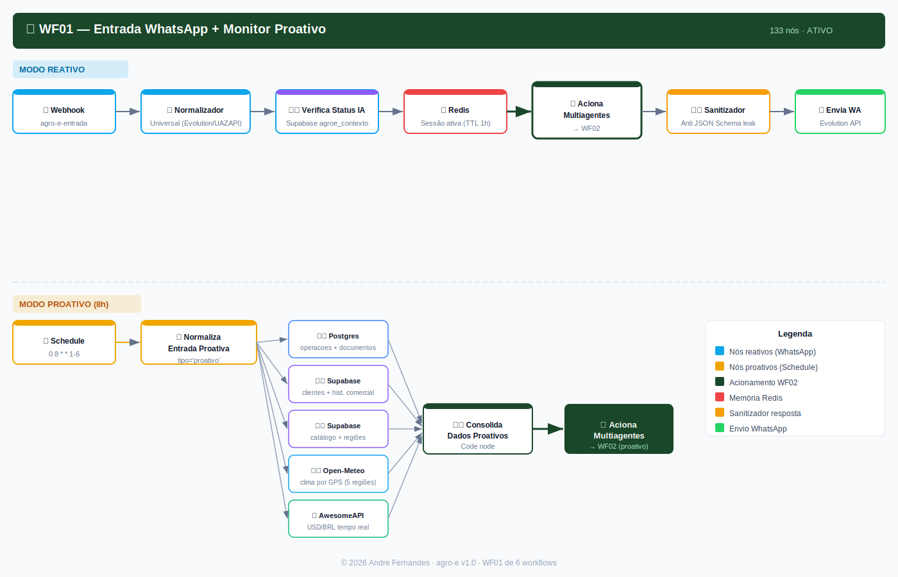
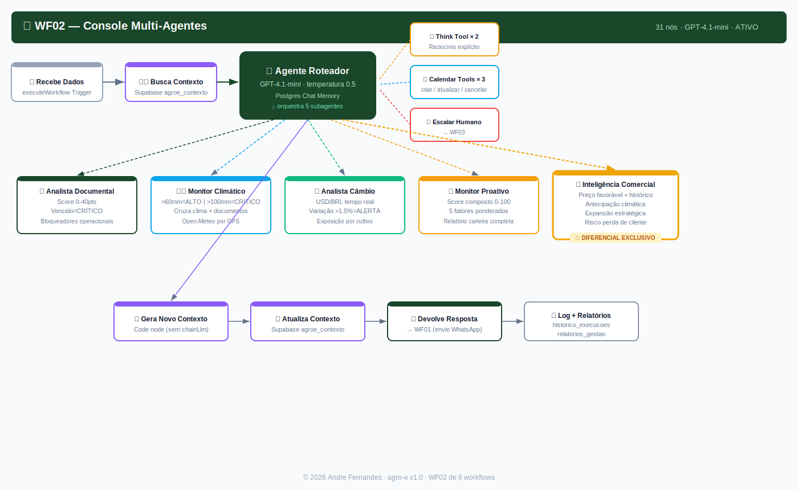
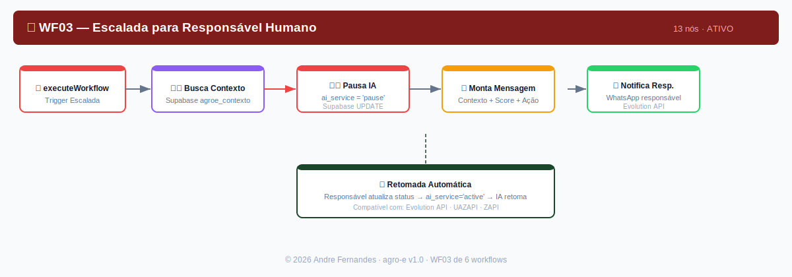
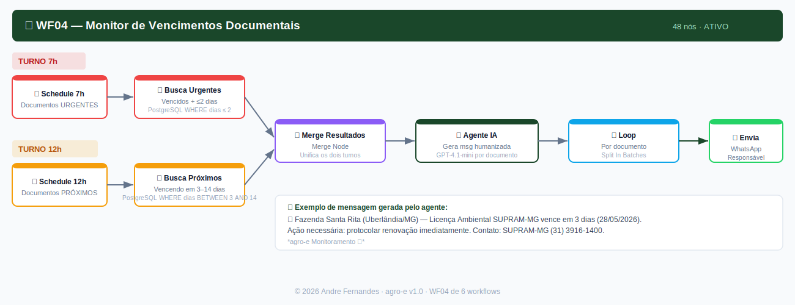
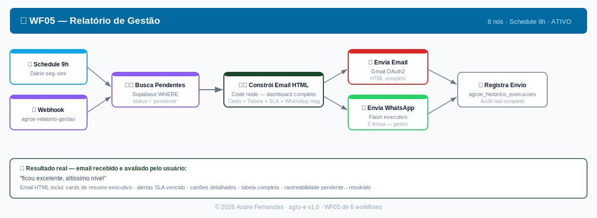
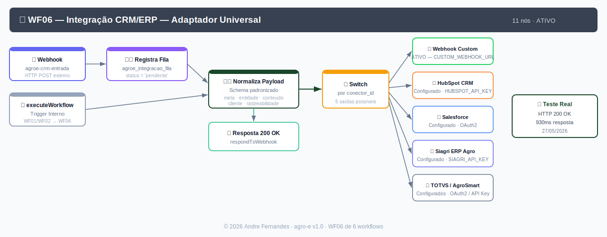

<div align="center">


<br/><br/>

# 🌱 agro-e
## Inteligência Agrícola Autônoma

**Sistema multi-agente de IA que monitora operações agrícolas, identifica riscos documentais, climáticos e cambiais, e descobre oportunidades comerciais — sem depender de input humano.**

> ⚠️ **Este não é um protótipo criado para demonstração.**  
> É uma solução completa em operação real, com WhatsApp respondendo, banco de dados populado e relatórios sendo enviados automaticamente por email às 9h de cada dia.

<br/>

[📊 Ver Evidências](https://github.com/airionntelligentsystems/Agro-e/tree/main/docs/evidencias) • [📄 Proposta Técnica](https://github.com/airionntelligentsystems/Agro-e/blob/main/docs/proposta/agroe-documentacao-tecnica-comercial.html) • [🏗️ Arquitetura](https://github.com/airionntelligentsystems/Agro-e/blob/main/docs/arquitetura/context-engineering.md) • [📋 Schema BD](https://github.com/airionntelligentsystems/Agro-e/blob/main/data/schema.md)

</div>

---

## ✅ Evidências de Produção

| Evidência | Status | Detalhe |
|-----------|--------|---------|
| WhatsApp respondendo mensagens reais | ✅ Confirmado | Mensagem real recebida e respondida em produção |
| Execuções n8n com sucesso | ✅ IDs: 27187, 27188, 27189, 27192 | Múltiplas execuções registradas |
| Relatório de gestão por email | ✅ Recebido e aprovado | *"ficou excelente, altíssimo nível"* |
| Memória conversacional acumulada | ✅ 28 mensagens no banco | PostgreSQL agroe_chat_memory |
| Webhook CRM respondendo | ✅ HTTP 200 OK em 930ms | POST /agroe-crm-entrada testado |
| 15 tabelas no banco de dados | ✅ Em produção | Supabase Arion us-east-1 |
| 6 workflows ativos | ✅ Todos ativos | n8n self-hosted em produção |

---

## 🏗️ Arquitetura do Sistema

```
┌─────────────────────────────────────────────────────────────────────┐
│              WF01 — ENTRADA + MONITOR PROATIVO (133 nós)            │
│  REATIVO:  WhatsApp → Evolution API → Normalizador → Redis → WF02  │
│  PROATIVO: Schedule 8h → 7 fontes simultâneas → WF02               │
│            └─ PostgreSQL · Supabase · Open-Meteo GPS · AwesomeAPI   │
└─────────────────────────────┬───────────────────────────────────────┘
                              │
┌─────────────────────────────▼───────────────────────────────────────┐
│              WF02 — CONSOLE MULTI-AGENTES (31 nós)                  │
│                                                                      │
│  🤖 Agente Roteador (GPT-4.1-mini · Postgres Chat Memory)           │
│  ├── 🤔 Think Tool × 2  (raciocínio explícito anti-alucinação)      │
│  ├── 📄 agente_analista_documental    → score 0-40pts               │
│  ├── 🌤️ agente_monitor_climatico      → Open-Meteo por GPS          │
│  ├── 💱 agente_analista_cambio        → AwesomeAPI USD/BRL           │
│  ├── 📊 agente_monitoramento_proativo → score composto 0-100         │
│  ├── 💼 agente_inteligencia_comercial → 4 tipos de oportunidade ★   │
│  ├── 📅 Google Calendar × 3 tools    → alertas automáticos          │
│  └── 🆘 encaminhar_responsavel_humano → WF03                         │
└────┬──────────────────┬──────────────────┬──────────────────────────┘
     │                  │                  │
┌────▼────┐      ┌──────▼──────┐    ┌──────▼──────┐    ┌─────────────┐
│  WF03   │      │    WF04     │    │    WF05     │    │    WF06     │
│ Escalada│      │ Vencimentos │    │  Relatório  │    │  CRM/ERP    │
│ Humano  │      │ 7h e 12h   │    │  9h diário  │    │  Universal  │
│ 13 nós  │      │  48 nós    │    │   8 nós     │    │  11 nós     │
└─────────┘      └─────────────┘    └─────────────┘    └─────────────┘
```

---

## 🖼️ Workflows em Produção

### WF01 — Entrada WhatsApp + Monitor Proativo (133 nós)


---

### WF02 — Console Multi-Agentes (31 nós)


---

### WF03 — Escalada para Responsável Humano (13 nós)


---

### WF04 — Monitor de Vencimentos Documentais (48 nós)


---

### WF05 — Relatório de Gestão — Email HTML + WhatsApp (8 nós)


---

### WF06 — Integração CRM/ERP — Adaptador Universal (11 nós)


---

## 🧠 Técnicas Implementadas

| # | Técnica | Como foi implementada | Nível |
|---|---------|----------------------|-------|
| 1 | **Prompt Engineering** | 7 system prompts distintos: papel, objetivo, escopo, formato, anti-hallucination e anti-injection por agente | ⭐⭐⭐ Avançado |
| 2 | **Context Engineering** | 3 camadas: Redis TTL 1h + PostgreSQL 90d + Supabase permanente. Recuperação antes de cada análise | ⭐⭐⭐ Avançado |
| 3 | **RAG / Recuperação** | PostgreSQL filtrado + Supabase por telefone + Open-Meteo por GPS + AwesomeAPI em tempo real | ⭐⭐⭐ Avançado |
| 4 | **Dados Estruturados** | 15 tabelas com constraints CHECK, foreign keys, índices, views materializadas e funções SQL | ⭐⭐⭐ Avançado |
| 5 | **API Externa Real** | Open-Meteo (clima por GPS, previsão 5 dias) + AwesomeAPI/BCB (USD/BRL). Zero custo. | ⭐⭐⭐ Avançado |
| 6 | **Orquestração Autônoma** | Schedule 8h seg-sáb: executa sem input humano. Agente decide subagentes e canais sozinho. | ⭐⭐⭐ Avançado |
| 7 | **Ferramentas/Workflows** | 6 workflows interligados. 10 tools no Roteador: Think×2, 5 subagentes, 3 Calendar, 1 escalada | ⭐⭐⭐ Avançado |
| 8 | **Classificação de Risco** | Score composto 0-100 com 5 fatores ponderados. 4 tipos de oportunidade comercial com ROI estimado | ⭐⭐⭐ Avançado |
| 9 | **Resposta Estruturada** | JSON com alertas + Email HTML + WhatsApp formatado + Google Calendar automático | ⭐⭐⭐ Avançado |
| 10 | **Logs / Rastreabilidade** | 4 tabelas de audit trail: historico_execucoes, relatorios_gestao, gestao_historico, lgpd_acesso_log | ⭐⭐⭐ Avançado |
| 11 | **Tratamento de Erros** | continueOnFail em todos os nós HTTP + Sanitizador de resposta (anti-JSON Schema leak) | ⭐⭐⭐ Avançado |
| 12 | **Segurança / Anti-Injection** | Anti-injection nos 7 prompts + Tags XML dados vs instrução + RLS Supabase + $vars para secrets | ⭐⭐⭐ Avançado |

---

## 📊 Score de Risco Composto

```
╔══════════════════════════════════════════════════════════════╗
║  Score = Documental(40) + Chamados(20) + Histórico(15)       ║
║        + Câmbio(15) + Clima(10) = máximo 100 pontos         ║
╠══════════════════════════════════════════════════════════════╣
║  Documental:  vencido=40 | 0-7d=35 | 8-30d=25 | indef=20   ║
║  Chamados:    +7pts por chamado crítico aberto (máx 20)      ║
║  Histórico:   histórico_atrasos=true → +15pts                ║
║  Câmbio:      crítica=15 | alta=8 | média=3                  ║
║  Climático:   >100mm=10 | >60mm=7 | moderado=5              ║
╠══════════════════════════════════════════════════════════════╣
║  🔴 CRÍTICO > 80  |  🟠 ALTO 60-79  |  🟡 MÉDIO 40-59       ║
║  🟢 BAIXO < 40                                               ║
╚══════════════════════════════════════════════════════════════╝

Exemplo real: OP-2026-RS-012 → Score 97/100 (CRÍTICO)
  Documental vencido=40 + 3 chamados=21 + histórico=15 + câmbio=15 + clima=7 → 97pts
```

---

## 💼 Inteligência Comercial — 4 Tipos de Oportunidade

| Tipo | Lógica | Exemplo Real |
|------|--------|-------------|
| **Preço Favorável** | Produto com histórico de compra caiu >3% | Ureia -5.7% → Roberto Gonçalves → R$ 116.400 potencial |
| **Antecipação Climática** | Seca/chuva prevista + cultivo sensível + produto relevante | Seca 14d + Milho + Gotejamento → Carlos Mendes → R$ 19M |
| **Expansão Estratégica** | Baixa presença + ponto fraco do concorrente | Jataí/GO 8% share, AgroMax fraco em pós-venda → R$ 392k/ano |
| **Retenção de Cliente** | Renovação próxima + concorrente avançando | Marina Costa + CanaSul → antecipar proposta → R$ 23.5k |

---

## 🗄️ Banco de Dados — 15 Tabelas

| Categoria | Tabelas | Registros |
|-----------|---------|-----------|
| **Operacionais** | agroe_operacoes, agroe_documentos, agroe_chamados, agroe_contexto, agroe_chat_memory, agroe_historico_execucoes | 28 msgs conversação |
| **Comerciais** | agroe_clientes, agroe_historico_comercial, agroe_catalogo_produtos, agroe_regioes_estrategicas, agroe_concorrentes | 16 transações históricas |
| **Gestão** | agroe_relatorios_gestao, agroe_gestao_historico, VIEW agroe_dashboard_gestao | 6 itens rastreáveis |
| **Integração/LGPD** | agroe_integracao_conectores, agroe_integracao_fila, agroe_lgpd_consentimento, agroe_lgpd_acesso_log | 6 conectores configurados |

---

## 🔗 Integração CRM/ERP

Conectores pré-configurados — ativação via variável de ambiente, zero desenvolvimento adicional:

| Conector | Tipo | Status |
|----------|------|--------|
| Salesforce | CRM | Configurado · OAuth2 |
| HubSpot | CRM | Configurado · API Key |
| Siagri | ERP Agro | Configurado · API Key |
| TOTVS Agri | ERP | Configurado · OAuth2 |
| AgroSmart | BI Agro | Configurado · API Key |
| **Webhook Genérico** | **Qualquer sistema** | **🟢 ATIVO — funcionando hoje** |

---

## 🛡️ Proteção LGPD

- **Row Level Security (RLS)** em todas as tabelas com dados pessoais
- **Anonimização SQL**: `agroe_anonimiza_telefone()` e `agroe_anonimiza_nome()`
- **Retenção mínima**: chat 90d · logs integração 180d · histórico 365d (limpeza automática)
- **Audit trail completo**: `agroe_lgpd_consentimento` + `agroe_lgpd_acesso_log`

---

## 📁 Estrutura do Repositório

```
Agro-e/
├── README.md                                    ← Este arquivo
├── data/
│   └── schema.md                               ← 15 tabelas com SQL, índices e LGPD
├── docs/
│   ├── arquitetura/
│   │   └── context-engineering.md             ← 3 camadas de memória e anti-injection
│   ├── evidencias/
│   │   ├── index.html                         ← Página visual de evidências
│   │   ├── execucoes-reais.md                 ← IDs de execução, WhatsApp, email
│   │   ├── relatorio-gestao-email.html        ← Cópia do email enviado em produção
│   │   ├── wf01-entrada-monitor-proativo.svg  ← Diagrama arquitetural WF01
│   │   └── wf02-console-multiagentes.svg      ← Diagrama arquitetural WF02
│   ├── prints/
│   │   ├── wf01-entrada-monitor-proativo.svg  ← Diagrama detalhado WF01 (133 nós)
│   │   ├── wf02-console-multiagentes.svg      ← Diagrama detalhado WF02 (31 nós)
│   │   ├── wf03-escalada-humano.svg           ← Diagrama WF03 (13 nós)
│   │   ├── wf04-monitor-vencimentos.svg       ← Diagrama WF04 (48 nós)
│   │   ├── wf05-relatorio-gestao.svg          ← Diagrama WF05 (8 nós)
│   │   └── wf06-integracao-crm-erp.svg        ← Diagrama WF06 (11 nós)
│   └── proposta/
│       ├── agroe-documentacao-tecnica-comercial.html  ← Proposta técnica completa
│       └── agroe-documentacao-tecnica-comercial.docx  ← Versão Word profissional
└── logs/
    └── execucao-exemplo-2026-05-27.json       ← Log real de execução (dados anonimizados)
```

---

## 🚀 Stack Tecnológico

| Componente | Tecnologia |
|-----------|-----------|
| Orquestração | n8n self-hosted |
| LLM | GPT-4.1-mini (OpenAI) |
| Banco de Dados | Supabase (PostgreSQL 17) |
| Memória Rápida | Redis (TTL 1h) |
| WhatsApp | Evolution API |
| Email | Gmail OAuth2 |
| Calendário | Google Calendar OAuth2 |
| Clima | Open-Meteo (gratuita, por GPS) |
| Câmbio | AwesomeAPI / BCB (pública) |

---

<div align="center">

**Desenvolvido por Andre Fernandes — Airion**  
*Inteligência Artificial Aplicada ao Agronegócio*

agro-e v1.0 · Maio 2026 · Em operação real

*© 2026 Andre Fernandes. Disponibilizado para fins de avaliação técnica.*

</div>
