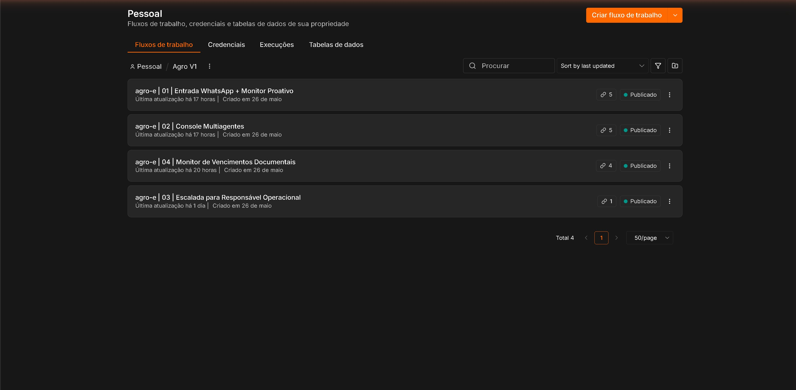
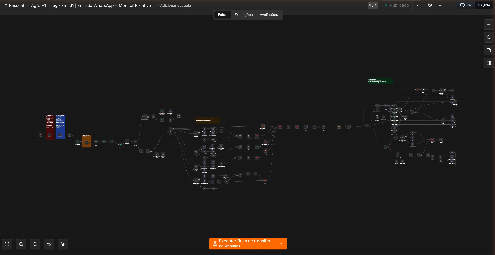
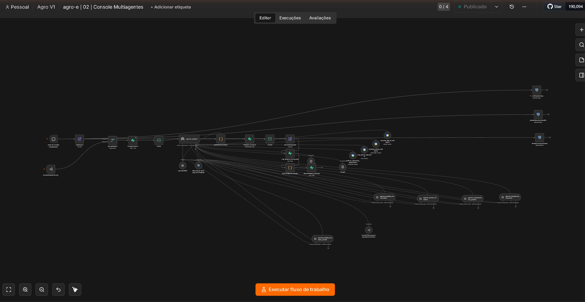
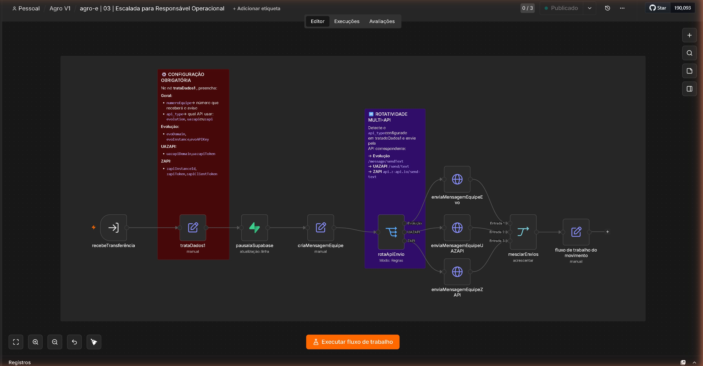
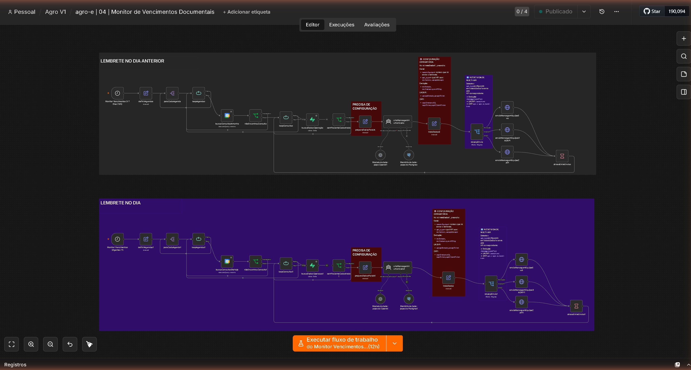

<div align="center">


<br/><br/>

# 🌱 agro-e
### Inteligência Agrícola Autônoma

**Sistema multi-agente de IA que monitora operações agrícolas, identifica riscos documentais, climáticos e cambiais, e descobre oportunidades comerciais — de forma completamente autônoma.**

<br/>

[📸 Prints Reais](docs/prints/real/) &nbsp;•&nbsp; [📧 Email de Gestão](docs/evidencias/relatorio-email-real-27052026.pdf) &nbsp;•&nbsp; [📊 Evidências](docs/evidencias/execucoes-reais.md) &nbsp;•&nbsp; [🏗️ Arquitetura](docs/arquitetura/context-engineering.md) &nbsp;•&nbsp; [📄 Proposta](docs/proposta/)

</div>

---

## 📸 Workflows em Produção — Prints Reais do n8n

### Lista de Workflows — todos publicados e ativos



---

### WF01 — Entrada WhatsApp + Monitor Proativo
*Porta de entrada do sistema. Recebe mensagens WhatsApp via Evolution API e dispara análise autônoma às 8h.*



---

### WF02 — Console Multi-Agentes
*Cérebro do sistema. Agente roteador + 5 subagentes especializados + Think Tool para raciocínio explícito.*



---

### WF03 — Escalada para Responsável Operacional
*Pausa a IA e notifica o responsável humano. Compatível com Evolution API, UAZAPI e ZAPI.*



---

### WF04 — Monitor de Vencimentos Documentais
*Dois turnos diários: 7h para urgentes (vencidos ou ≤2 dias) e 12h para próximos (3–14 dias).*



---

## 📧 Relatório de Gestão — Email Real Enviado e Recebido

O relatório é gerado automaticamente e enviado por email (Gmail OAuth2) e WhatsApp todo dia útil.

📄 **[Ver PDF do email real recebido no Outlook — 27/05/2026](docs/evidencias/relatorio-email-real-27052026.pdf)**

---

## 🏗️ Arquitetura

```
┌─────────────────────────────────────────────────────────────────────┐
│              WF01 — ENTRADA + MONITOR PROATIVO (133 nós)            │
│  REATIVO:  WhatsApp → Evolution API → Normalizador → Redis → WF02  │
│  PROATIVO: Schedule 8h → 7 fontes simultâneas → WF02               │
│            └─ PostgreSQL · Supabase · Open-Meteo GPS · AwesomeAPI   │
└─────────────────────────────┬───────────────────────────────────────┘
                              │
┌─────────────────────────────▼───────────────────────────────────────┐
│              WF02 — CONSOLE MULTI-AGENTES (31 nós)                  │
│                                                                      │
│  🤖 Agente Roteador (GPT-4.1-mini · Postgres Chat Memory)           │
│  ├── 🤔 Think Tool × 2  (raciocínio explícito)                      │
│  ├── 📄 agente_analista_documental    → score 0-40pts               │
│  ├── 🌤️ agente_monitor_climatico      → Open-Meteo por GPS          │
│  ├── 💱 agente_analista_cambio        → AwesomeAPI USD/BRL           │
│  ├── 📊 agente_monitoramento_proativo → score composto 0-100         │
│  ├── 💼 agente_inteligencia_comercial → 4 tipos de oportunidade      │
│  ├── 📅 Google Calendar × 3 tools    → alertas automáticos          │
│  └── 🆘 encaminhar_responsavel_humano → WF03                         │
└────┬──────────────────┬──────────────────┬──────────────────────────┘
     │                  │                  │
┌────▼────┐      ┌──────▼──────┐    ┌──────▼──────┐    ┌─────────────┐
│  WF03   │      │    WF04     │    │    WF05     │    │    WF06     │
│ Escalada│      │ Vencimentos │    │  Relatório  │    │  CRM/ERP   │
│ 13 nós  │      │  48 nós    │    │   8 nós     │    │  11 nós     │
└─────────┘      └─────────────┘    └─────────────┘    └─────────────┘
```

---

## ⚙️ Técnicas Implementadas

| Técnica | Implementação |
|---------|--------------|
| Prompt Engineering | 7 system prompts distintos por agente, com papel, escopo, formato e proteção anti-injection |
| Context Engineering | 3 camadas: Redis TTL 1h (sessão) + PostgreSQL 90d (histórico) + Supabase permanente (perfil) |
| RAG / Recuperação | PostgreSQL filtrado + Supabase por telefone + Open-Meteo por GPS + AwesomeAPI em tempo real |
| Dados Estruturados | 15 tabelas com constraints, índices, views materializadas e funções SQL |
| API Externa Real | Open-Meteo (clima por GPS) + AwesomeAPI/BCB (USD/BRL). Chamadas a cada execução proativa. |
| Orquestração Autônoma | Schedule 8h seg–sáb: o sistema inicia, coleta dados, analisa e notifica sem nenhum input humano |
| Ferramentas e Workflows | 6 workflows interligados. 10 tools no Roteador: Think×2, 5 subagentes, 3 Calendar, 1 escalada |
| Classificação de Risco | Score composto 0-100 com 5 fatores ponderados. 4 tipos de oportunidade comercial identificados |
| Resposta Estruturada | JSON com alertas + Email HTML + WhatsApp formatado + Google Calendar com eventos automáticos |
| Logs e Rastreabilidade | 4 tabelas de audit trail: historico_execucoes, relatorios_gestao, gestao_historico, lgpd_acesso_log |
| Tratamento de Erros | continueOnFail em todos os nós HTTP + Sanitizador de resposta anti-vazamento técnico |
| Segurança | Anti-injection nos prompts + Tags XML dados vs instrução + RLS Supabase + secrets via $vars |

---

## 📊 Score de Risco Composto (0–100)

```
Documental:  vencido=40 | 0-7d=35 | 8-30d=25 | indefinido=20
Chamados:    +7pts por chamado crítico aberto (máximo 20pts)
Histórico:   histórico_atrasos=true → +15pts
Câmbio:      crítica=15 | alta=8 | média=3
Climático:   >100mm=10 | >60mm=7 | moderado=5

🔴 CRÍTICO > 80  |  🟠 ALTO 60-79  |  🟡 MÉDIO 40-59  |  🟢 BAIXO < 40
```

---

## 💼 Inteligência Comercial — 4 Tipos de Oportunidade

| Tipo | Lógica |
|------|--------|
| Preço Favorável | Produto com histórico de compra caiu >3% — acionamento imediato |
| Antecipação Climática | Seca/chuva prevista + cultivo sensível + produto relevante no catálogo |
| Expansão Estratégica | Baixa presença da empresa + ponto fraco identificado no concorrente |
| Retenção de Cliente | Renovação próxima + concorrente avançando na mesma região |

---

## 🗄️ Banco de Dados — 15 Tabelas

| Categoria | Tabelas |
|-----------|---------|
| Operacionais | agroe_operacoes, agroe_documentos, agroe_chamados, agroe_contexto, agroe_chat_memory, agroe_historico_execucoes |
| Comerciais | agroe_clientes, agroe_historico_comercial, agroe_catalogo_produtos, agroe_regioes_estrategicas, agroe_concorrentes |
| Gestão | agroe_relatorios_gestao, agroe_gestao_historico, VIEW agroe_dashboard_gestao |
| Integração/LGPD | agroe_integracao_conectores, agroe_integracao_fila, agroe_lgpd_consentimento, agroe_lgpd_acesso_log |

---

## 🔗 Integração CRM/ERP — Adaptador Universal

| Conector | Tipo | Ativação |
|----------|------|----------|
| Salesforce | CRM | Definir SALESFORCE_CLIENT_ID e CLIENT_SECRET |
| HubSpot | CRM | Definir HUBSPOT_API_KEY |
| Siagri | ERP Agro | Definir SIAGRI_API_KEY e SIAGRI_EMPRESA_ID |
| TOTVS Agri | ERP | Definir TOTVS_CLIENT_ID e CLIENT_SECRET |
| AgroSmart | BI Agro | Definir AGROSMART_API_KEY |
| Webhook Genérico | Qualquer sistema | Definir CUSTOM_WEBHOOK_URL — já funcional |

---

## 🛡️ Proteção LGPD

- Row Level Security (RLS) em todas as tabelas com dados pessoais
- Funções de anonimização SQL para relatórios e exportações
- Política de retenção automática: chat 90d · logs 180d · histórico 365d
- Audit trail completo de acesso e tratamento de dados pessoais

---

## 📁 Estrutura

```
Agro-e/
├── README.md
├── data/
│   └── schema.md                              ← 15 tabelas com SQL, índices e LGPD
├── docs/
│   ├── arquitetura/
│   │   └── context-engineering.md            ← 3 camadas, anti-injection, fluxo de dados
│   ├── evidencias/
│   │   ├── execucoes-reais.md                ← IDs de execução reais no n8n
│   │   ├── index.html                        ← Página visual de evidências
│   │   ├── relatorio-email-real-27052026.pdf ← Email real enviado e recebido
│   │   └── *.svg                             ← Diagramas arquiteturais
│   ├── prints/
│   │   └── real/                             ← Screenshots reais do n8n em produção
│   └── proposta/
│       ├── *.html                            ← Documentação técnica e comercial
│       └── *.docx                            ← Versão Word profissional
└── logs/
    └── execucao-exemplo-2026-05-27.json      ← Log real de execução (dados anonimizados)
```

---

## 🚀 Stack

| Componente | Tecnologia |
|-----------|-----------|
| Orquestração | n8n self-hosted |
| LLM | GPT-4.1-mini (OpenAI) |
| Banco de Dados | Supabase (PostgreSQL 17) |
| Memória Rápida | Redis (TTL 1h) |
| WhatsApp | Evolution API |
| Email | Gmail OAuth2 |
| Calendário | Google Calendar OAuth2 |
| Clima | Open-Meteo (por GPS) |
| Câmbio | AwesomeAPI / BCB |

---

<div align="center">

**Andre Fernandes**  
*Inteligência Artificial Aplicada ao Agronegócio*

agro-e v1.0 · Maio 2026

*© 2026 Andre Fernandes. Disponibilizado para fins de avaliação técnica.*

</div>
